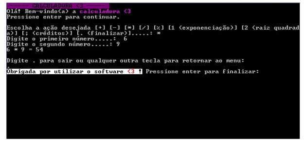

# Calculadora <3

Este software realiza cálculos de operações simples. 

---
## Manual de instruções

- Leia atentamente as instruções dadas pelo próprio programa;
- Depois de cada operação e número pressione enter.

PS.: Em algumas ações ("2" , ";" e "."), após o seu uso, o programa encerrará.

## Exemplo

 ----- CALCULADORA <3 ----- 

Olá! Bem-vindo(a) a calculadora <3

Pressione enter para continuar.

Escolha a ação desejada [+] [-] [*] [/] [%] [1 (exponenciação)] [2 (raiz quadrada)] [; (créditos)] [. (finalizar)].....:

Digite o primeiro número.....:  6

Digite o segundo número.....: 9

6 * 9 = 54

Digite . para sair ou qualquer outra tecla para retornar ao menu:

Obrigada por utilizar o software <3 ! Pressione enter para finalizar:

## _Screenshot_

## _Download_
Baixe o arquivo abaixo e descompacte na pasta desejada.

--> [Download do arquivo .zip](dist/CalculadoraBarbara.zip)

Execute utilizando o comando:

--> dotnet CalculadoraBarbara.dll

ou, se você estiver no Windows, pode dar um duplo-clique no ícone do programa.

## Comentários da desenvolvedora

"Todo o processo de realização deste software foi um desafio. Colocar os conhecimentos em prática de maneira satisfatória é, sem sombra de dúvidas, a parte mais difícil (e legal também). 

Gostei muito do resultado final (mesmo ainda sentindo que posso melhorar muito), ver o meu primeiro projeto finalizado é empolgante! Peço a paciência no uso do mesmo... Em breve terão outros melhores, se Deus quiser (risos)."

--> _Bárbara Rodrigues de Oliveira_

## Agradecimentos

- [Etec Adolpho Berezin](http://https://eteab.com.br/)
- [Professor Ermogenes Palacio](http://https://github.com/ermogenes)
- [Professor Diego Neri](http://https://github.com/diegoneri)
- [Dev C#](http://https://github.com/barbararoliveira/CalculadoraBarbara)

---
Todos os direitos reservados. PIRATARIA É CRIME.

